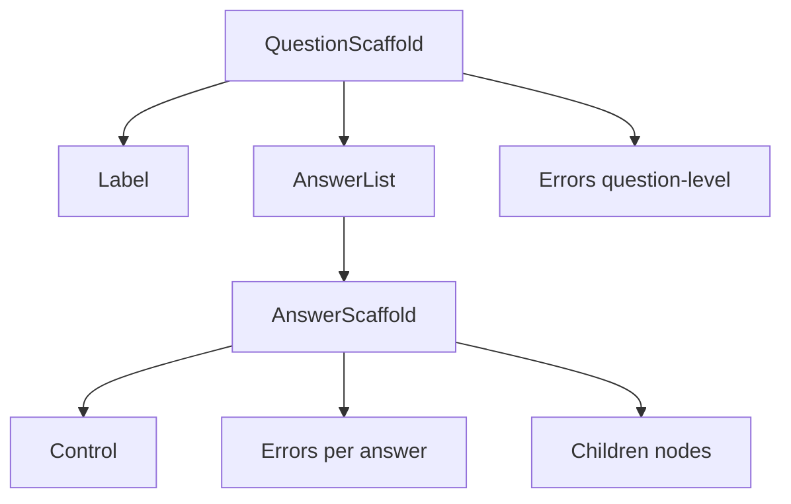
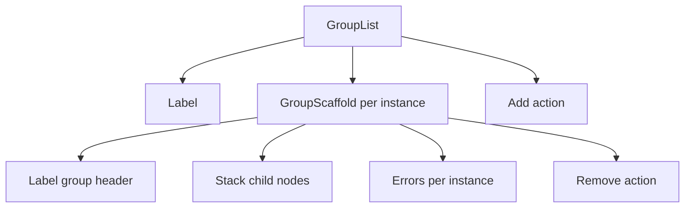

Scaffold components are the structural skeleton of the rendered questionnaire. They compose the header, answer controls, nested nodes, and error displays into a predictable tree. The renderer controls what goes into each slot; your scaffold components control how those slots are positioned and styled.

There are two scaffold families: the **question** family (`QuestionScaffold → AnswerList → AnswerScaffold`) and the **group** family (`GroupList → GroupScaffold`). Understanding how they nest is essential for building a correct layout.

---

## Composition overview

### Question nodes

A typical question node renders like this:

```text
QuestionScaffold
  header (Label)
  AnswerList (or a single control)
    AnswerScaffold (one per answer instance)
      control  (TextInput, SelectInput, etc.)
      children (nested nodes)
      errors   (Errors — per-answer)
      remove action (when onRemove is provided)
  errors (Errors — question-level)
```



### Group nodes

A repeating group list renders like this:

```text
GroupList
  header (Label — only when the group list has visible text)
  GroupScaffold (one per group instance)
    header (Label — group instance label)
    children (Stack of child nodes)
    errors (Errors — per-instance)
    remove action (when onRemove is provided)
  add action (when onAdd is provided)
```



A non-repeating group renders as a single `GroupScaffold` without a `GroupList` wrapper:

```text
GroupScaffold
  header (Label — when visible)
  children (Stack of child nodes)
  errors (Errors)
```

---

## QuestionScaffold

Outer shell for a question node. It organizes the question header, the answer body (controls and per-answer errors), and question-level validation feedback. Use `isExpanded` to decide whether to render or visually hide the question body.

<AccordionGroup>
  <Accordion title="Props">
    <ParamField path="linkId" type="string" required>
      The question's FHIR `linkId`. Render as a `data-link-id` attribute for debugging, or ignore it.
    </ParamField>
    <ParamField path="children" type="ReactNode" required>
      The question body content: controls and answer-level errors, wrapped in `AnswerList`/`AnswerScaffold`.
    </ParamField>
    <ParamField path="isExpanded" type="boolean" required>
      Current expanded state for collapsible questions. When `false`, hide or collapse the body content.
    </ParamField>
    <ParamField path="header" type="ReactNode">
      The question header: label, help, legal, and flyover slots composed by the renderer. Render above the body.
    </ParamField>
    <ParamField path="errors" type="ReactNode">
      Question-level validation errors. Render below the answer body.
    </ParamField>
    <ParamField path="signature" type="ReactNode">
      Signature content when provided by the renderer.
    </ParamField>
  </Accordion>
  <Accordion title="Example implementation">
    ```tsx
    import type { QuestionScaffoldComponent } from "@formbox/theme";

    const QuestionScaffold: QuestionScaffoldComponent = ({
      linkId,
      header,
      children,
      errors,
      isExpanded,
    }) => (
      <div data-link-id={linkId}>
        {header}
        {isExpanded && <div>{children}</div>}
        {errors}
      </div>
    );
    ```
  </Accordion>
</AccordionGroup>

---

## AnswerList

Container that lays out one or more answer instances and an optional add-answer control. It handles spacing and ordering of answer rows. Render an add-answer affordance when `onAdd` is provided.

<Tip>
  Use `useStrings()` and the `selection.addAnother` path to source the add-answer button label so it works across questionnaire languages.
</Tip>

<AccordionGroup>
  <Accordion title="Props">
    <ParamField path="children" type="ReactNode" required>
      The list of `AnswerScaffold` instances supplied by the renderer. Render them in order.
    </ParamField>
    <ParamField path="onAdd" type="() => void">
      When provided, render an add-another-answer control and call this when the user activates it.
    </ParamField>
    <ParamField path="canAdd" type="boolean">
      When `false`, render the add control disabled rather than hiding it.
    </ParamField>
  </Accordion>
  <Accordion title="Recommended translation strings">
    | Path | Text |
    |------|------|
    | `selection.addAnother` | Label for the add-another-answer action |
  </Accordion>
  <Accordion title="Example implementation">
    ```tsx
    import type { AnswerListComponent } from "@formbox/theme";
    import { useStrings } from "@formbox/theme";

    const AnswerList: AnswerListComponent = ({ children, onAdd, canAdd }) => {
      const strings = useStrings();
      return (
        <div>
          {children}
          {onAdd && (
            <button type="button" onClick={onAdd} disabled={canAdd === false}>
              {strings["selection.addAnother"]}
            </button>
          )}
        </div>
      );
    };
    ```
  </Accordion>
</AccordionGroup>

---

## AnswerScaffold

Layout for a single answer row. It combines the main input control, an optional remove action, nested child nodes (for linked child questions), and per-answer validation errors. Render a remove affordance when `onRemove` is provided.

<Warning>
  When `canRemove` is `false`, render the remove action as disabled — do not hide it. This preserves the layout and communicates to the user that removal is currently restricted.
</Warning>

<AccordionGroup>
  <Accordion title="Props">
    <ParamField path="control" type="ReactNode" required>
      The main input control for this answer instance (for example, a `TextInput` or `SelectInput`).
    </ParamField>
    <ParamField path="onRemove" type="() => void">
      When provided, render a remove-answer action and call this when the user activates it.
    </ParamField>
    <ParamField path="canRemove" type="boolean">
      When `false`, render the remove action disabled.
    </ParamField>
    <ParamField path="errors" type="ReactNode">
      Per-answer validation errors. Render near the answer control.
    </ParamField>
    <ParamField path="children" type="ReactNode">
      Nested child nodes linked to this answer. Render below the control and errors.
    </ParamField>
  </Accordion>
  <Accordion title="Example implementation">
    ```tsx
    import type { AnswerScaffoldComponent } from "@formbox/theme";

    const AnswerScaffold: AnswerScaffoldComponent = ({
      control,
      onRemove,
      canRemove,
      errors,
      children,
    }) => (
      <div>
        <div style={{ display: "flex", gap: "8px" }}>
          {control}
          {onRemove && (
            <button
              type="button"
              onClick={onRemove}
              disabled={canRemove === false}
              aria-label="Remove answer"
            >
              ×
            </button>
          )}
        </div>
        {errors}
        {children}
      </div>
    );
    ```
  </Accordion>
</AccordionGroup>

---

## GroupList

Wrapper for a repeating group that holds the collection of group instances and an optional add control. Render a group header when `header` is provided (only when the group list has visible label text).

<AccordionGroup>
  <Accordion title="Props">
    <ParamField path="linkId" type="string" required>
      The group's FHIR `linkId`. Render as a `data-link-id` attribute for debugging, or ignore it.
    </ParamField>
    <ParamField path="children" type="ReactNode" required>
      Each `GroupScaffold` instance in the repeating group. Render them in order.
    </ParamField>
    <ParamField path="header" type="ReactNode">
      The group list header (label, help, legal, flyover). Render above the instances when provided.
    </ParamField>
    <ParamField path="onAdd" type="() => void">
      When provided, render an add-group control and call this when the user activates it.
    </ParamField>
    <ParamField path="canAdd" type="boolean">
      When `false`, render the add control disabled rather than hiding it.
    </ParamField>
  </Accordion>
  <Accordion title="Recommended translation strings">
    | Path | Text |
    |------|------|
    | `group.addSection` | Label for the add-group-instance action |
  </Accordion>
  <Accordion title="Example implementation">
    ```tsx
    import type { GroupListComponent } from "@formbox/theme";
    import { useStrings } from "@formbox/theme";

    const GroupList: GroupListComponent = ({
      linkId,
      header,
      children,
      onAdd,
      canAdd,
    }) => {
      const strings = useStrings();
      return (
        <div data-link-id={linkId}>
          {header}
          {children}
          {onAdd && (
            <button type="button" onClick={onAdd} disabled={canAdd === false}>
              {strings["group.addSection"]}
            </button>
          )}
        </div>
      );
    };
    ```
  </Accordion>
</AccordionGroup>

---

## GroupScaffold

Layout shell for a single group instance — whether repeating or not. It renders the group header, body content, errors, and an optional remove action. Use `isExpanded` to decide whether to render or visually hide the group body.

<Warning>
  When `canRemove` is `false`, render the remove action as disabled — do not hide it.
</Warning>

<AccordionGroup>
  <Accordion title="Props">
    <ParamField path="isExpanded" type="boolean" required>
      Current expanded state for collapsible groups. When `false`, hide or collapse the body content.
    </ParamField>
    <ParamField path="header" type="ReactNode">
      The group instance header (label, help, legal, flyover). Render above the body when provided.
    </ParamField>
    <ParamField path="children" type="ReactNode">
      The group body content: a `Stack` of child nodes.
    </ParamField>
    <ParamField path="errors" type="ReactNode">
      Per-instance validation errors. Render near the group content.
    </ParamField>
    <ParamField path="signature" type="ReactNode">
      Signature content when provided by the renderer.
    </ParamField>
    <ParamField path="onRemove" type="() => void">
      When provided, render a remove-instance action and call this when the user activates it.
    </ParamField>
    <ParamField path="canRemove" type="boolean">
      When `false`, render the remove action disabled.
    </ParamField>
  </Accordion>
  <Accordion title="Recommended translation strings">
    | Path | Text |
    |------|------|
    | `group.removeSection` | Label for the remove-group-instance action |
  </Accordion>
  <Accordion title="Example implementation">
    ```tsx
    import type { GroupScaffoldComponent } from "@formbox/theme";
    import { useStrings } from "@formbox/theme";

    const GroupScaffold: GroupScaffoldComponent = ({
      header,
      children,
      errors,
      isExpanded,
      onRemove,
      canRemove,
    }) => {
      const strings = useStrings();
      return (
        <div>
          <div style={{ display: "flex", justifyContent: "space-between" }}>
            {header}
            {onRemove && (
              <button
                type="button"
                onClick={onRemove}
                disabled={canRemove === false}
              >
                {strings["group.removeSection"]}
              </button>
            )}
          </div>
          {isExpanded && <div>{children}</div>}
          {errors}
        </div>
      );
    };
    ```
  </Accordion>
</AccordionGroup>

---

## Repeating items contract

These rules apply to both question repeats (via `AnswerList`/`AnswerScaffold`) and group repeats (via `GroupList`/`GroupScaffold`):

- `onAdd` is provided when adding another instance is allowed. Render an add affordance.
- `canAdd={false}` means the add limit has been reached. Render the button disabled, not hidden.
- `onRemove` is provided on each instance when removal is allowed. Render a remove affordance per instance.
- `canRemove={false}` means this instance cannot currently be removed. Render the button disabled, not hidden.
- Per-instance `errors` are provided by the renderer. Render them near the instance content.
